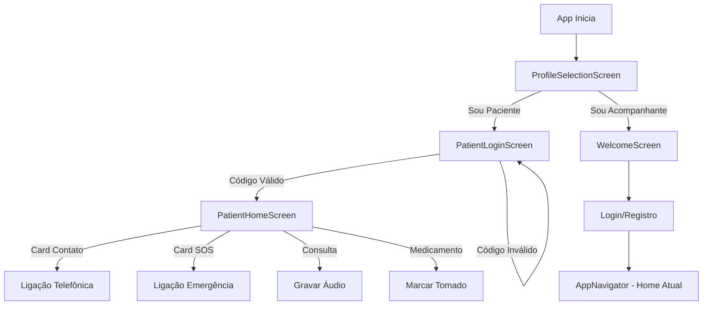

# Modo Paciente Implementado! 🎉

## Visão Geral

Foi implementado um sistema completo de acesso dual (Paciente e Acompanhante) com funcionalidades específicas para cada perfil.

---

## 🆕 Novas Telas Criadas

### 1. **ProfileSelectionScreen** (Tela de Seleção de Perfil)
**Arquivo:** `src/screens/Auth/ProfileSelectionScreen.js`

- ✅ Tela inicial do aplicativo
- ✅ Logo Laços centralizado
- ✅ Dois botões grandes:
  - 🧑 **Sou Paciente** → Interface simplificada
  - ❤️ **Sou Acompanhante** → Interface completa (atual)

### 2. **PatientLoginScreen** (Login do Paciente)
**Arquivo:** `src/screens/Patient/PatientLoginScreen.js`

- ✅ Campo para inserir código do grupo
- ✅ Validação do código (busca nos grupos salvos)
- ✅ Instruções claras para idosos
- ✅ Feedback visual e erros amigáveis

### 3. **PatientHomeScreen** (Home do Paciente)
**Arquivo:** `src/screens/Patient/PatientHomeScreen.js`

#### Funcionalidades:

**a) Cards de Contatos (Grid 2x2):**
- ✅ 3 Cards de contatos com ligação direta
- ✅ 1 Card SOS para emergências
- ✅ Cada card tem cor diferente e ícone grande
- ✅ Ao clicar: confirmação antes de ligar

**b) Botão SOS:**
- ✅ Cor vermelha de destaque
- ✅ Ícone de alerta grande
- ✅ Confirmação de emergência
- ✅ Liga para contatos de emergência

**c) Lista de Notificações:**
- ✅ Notificações de consultas agendadas
- ✅ Alertas de medicamentos
- ✅ Cards grandes e legíveis

**d) Gravação de Áudio:**
- ✅ Ao clicar em consulta → opção de gravar áudio
- ✅ Usa expo-av para gravação
- ✅ Solicita permissão de microfone
- ✅ Feedback visual durante gravação
- ✅ Áudio vinculado à consulta

---

## 📁 Estrutura de Arquivos

```
src/
├── screens/
│   ├── Auth/
│   │   └── ProfileSelectionScreen.js ✨ NOVO
│   └── Patient/ ✨ NOVA PASTA
│       ├── PatientLoginScreen.js ✨ NOVO
│       └── PatientHomeScreen.js ✨ NOVO
└── navigation/
    ├── PatientNavigator.js ✨ NOVO
    └── AuthNavigator.js (atualizado)
```

---

## 🔄 Fluxo de Navegação

### Fluxo do Paciente:
```
1. ProfileSelectionScreen
   └─ "Sou Paciente"
      └─ PatientLoginScreen
         └─ Digita código
            └─ PatientHomeScreen
               ├─ Clique em contato → Ligação
               ├─ Clique em SOS → Ligação emergência
               └─ Clique em consulta → Gravar áudio
```

### Fluxo do Acompanhante:
```
1. ProfileSelectionScreen
   └─ "Sou Acompanhante"
      └─ WelcomeScreen
         └─ Login/Registro
            └─ AppNavigator (atual)
```

---

## 🔐 Sistema de Códigos

### Como Funciona:

1. **Acompanhante cria grupo:**
   - Vai em "Criar Grupo"
   - Preenche dados
   - Sistema gera código (ex: A1B2C3D4)
   
2. **Código é compartilhado:**
   - Acompanhante anota/envia código ao paciente
   
3. **Paciente usa código:**
   - Abre app → "Sou Paciente"
   - Digita código
   - Acessa home filtrada para seu grupo

**Armazenamento:**
- Código salvo no grupo: `group.code`
- Sessão do paciente: `@lacos_patient_session`

---

## 📱 Funcionalidades da Home do Paciente

### Cards de Contatos (3 primeiros)
```javascript
Card 1: João Silva    - Ligação direta
Card 2: Maria Santos  - Ligação direta
Card 3: Pedro Costa   - Ligação direta
Card 4: SOS/Ajuda     - Ligação emergência
```

**Interação:**
- Toque → Confirmação → Ligação telefônica
- Usa `Linking.openURL()` do React Native
- Compatível com iOS e Android

### Card SOS (4º card)
- Cor vermelha destacada
- Ícone de alerta grande
- Texto "Ajuda"
- Liga para todos os contatos de emergência

### Notificações
1. **Consultas Agendadas:**
   - Ícone de calendário
   - Título e descrição
   - Data e hora
   - Ao clicar: opção de gravar áudio
   
2. **Medicamentos:**
   - Ícone de remédio
   - Nome e dosagem
   - Horário
   - Ao clicar: marcar como tomado

### Gravação de Áudio
```javascript
Fluxo:
1. Paciente clica em consulta
2. Alert: "Deseja gravar anotação?"
3. Solicita permissão de microfone
4. Inicia gravação
5. Alert: "Gravando... Pressione OK para parar"
6. Para gravação
7. Salva áudio vinculado à consulta
8. Notifica cuidadores
```

---

## 🎨 Design da Interface do Paciente

### Princípios:
- ✅ **Grandes elementos clicáveis** (cards maiores)
- ✅ **Cores vibrantes e diferenciadas**
- ✅ **Ícones grandes e claros**
- ✅ **Textos em fonte grande**
- ✅ **Confirmações antes de ações importantes**
- ✅ **Feedback visual constante**

### Paleta de Cores:
- Contato 1: Azul primário
- Contato 2: Roxo secundário
- Contato 3: Azul info
- SOS: Vermelho erro

---

## 🔧 Configurações Adicionadas

### app.json
```json
{
  "android": {
    "permissions": ["RECORD_AUDIO", "CALL_PHONE"]
  },
  "ios": {
    "infoPlist": {
      "NSMicrophoneUsageDescription": "Para gravar anotações de áudio",
      "NSContactsUsageDescription": "Para facilitar ligações"
    }
  },
  "plugins": [
    ["expo-av", {
      "microphonePermission": "Acesso ao microfone"
    }]
  ]
}
```

### Dependências Instaladas
- ✅ `expo-av` - Para gravação de áudio

---

## 🧪 Como Testar

### 1. Criar Grupo (como Acompanhante):
```
1. Escolha "Sou Acompanhante"
2. Login → Home → Grupos
3. Criar Grupo "Rosa"
4. Anote o código gerado (ex: A1B2C3D4)
```

### 2. Entrar como Paciente:
```
1. Reinicie app ou faça logout
2. Escolha "Sou Paciente"
3. Digite o código do grupo
4. Acesse a home do paciente
```

### 3. Testar Funcionalidades:
```
✅ Clicar nos cards de contatos → Ver confirmação
✅ Clicar no SOS → Ver alerta de emergência
✅ Clicar em consulta → Opção de gravar
✅ Gravar áudio → Ver feedback de gravação
✅ Logout → Voltar à seleção de perfil
```

---

## 📋 TODOs Futuros

### Backend Integration:
- [ ] Carregar contatos reais do grupo
- [ ] Salvar gravações de áudio no servidor
- [ ] Sincronizar notificações em tempo real
- [ ] Implementar chamadas em conferência real (SOS)

### Funcionalidades Adicionais:
- [ ] Tela de configuração de contatos
- [ ] Player de áudio para ouvir gravações
- [ ] Histórico de ligações
- [ ] Configurar quais contatos respondem ao SOS

---

## 🎯 Fluxo Completo



---

**Status:** ✅ Totalmente Implementado
**Data:** 22/11/2025
**Pronto para Testes:** Sim! 🚀

